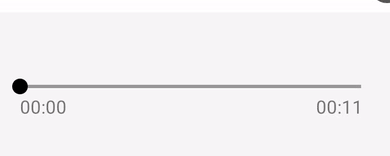

# timertextview

I created this project when I was working on a feature of my company to show the timer while recording audio. 



Through this i also learned the android's basic blocks of [Handler](https://developer.android.com/reference/android/os/Handler#:~:text=A%20Handler%20allows%20you%20to,is%20bound%20to%20a%20Looper%20), [Looper](https://developer.android.com/reference/kotlin/android/os/Looper#:~:text=android.os.Looper,until%20the%20loop%20is%20stopped), [MessageQueue](https://developer.android.com/reference/android/os/MessageQueue). 

To use this library:
```
  //project level build.gradle file:
  allprojects {
    repositories {
        mavenLocal()
        maven { url 'https://maven.google.com' } 
        maven { url "https://jitpack.io" } // <-- add this!
    }
  }
  
  //app level build.gradle file include:
  implementation 'com.github.Shubhamsdr3:timertextview:X.X.X' // <-- replace with latest release version
  
```

How to use:

```
 <com.pandey.shubham.timertextview.TimerTextView
        android:id="@+id/timer_text"
        android:layout_width="wrap_content"
        android:layout_height="wrap_content"
        android:textSize="18sp"
        tools:text="10:01" />
        
        timer_text.setInitialTime(10) // To set start time(in seconds)
        
        timer_text.startIncrementTimer() // to start incrementing by one second
        
         timer_text.startDecrementTimer() // to start decrementing by one second
         
         timer_text.stopTimer() // to stop the timer(will automatically be resumed)
         
         timer_text.resetTimer() // to reset the timer(wll start from 0:0)
        
```        


Latest release: [](https://jitpack.io/#Shubhamsdr3/timertextview)
